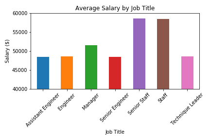
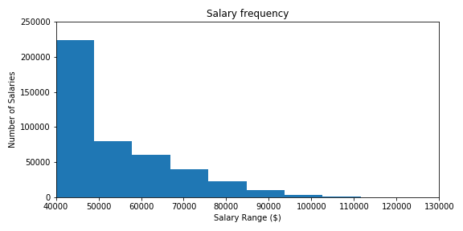
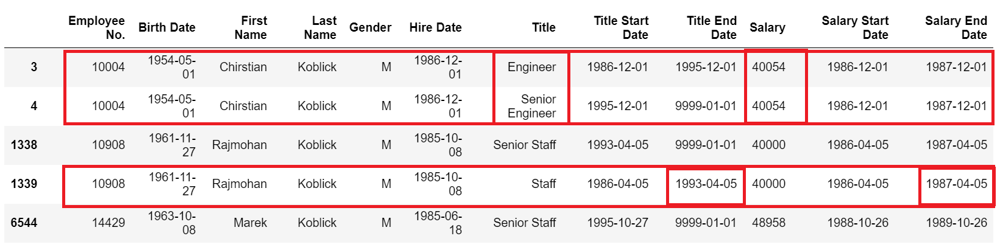

## Observations

At a high level, the data shows trends that seem inconsistent or counterintuitive. See for example the Average Salary and Salary Frequency points below.

### Average Salary

* The average salary is almost identical for Assistant Engineers, Engineers, and Senior Engineers. This suggests that employees in the same career path but with different levels of experience are being paid similar salaries. 
* Additionally, employees in the Staff category have a higher average salary than either Senior Engineers or Managers, suggesting that members of the general staff are being paid more than those in technical or managerial roles. 

### Salary Frequency

* According to a grouping of the frequency of salary earnings, 233,486 people earned a salary between $40,000-$49,999. Assuming that the average salary in this bin would be $45,000, this would mean that HP paid employees in this category a total of over $‭10.5 billion‬ during the 1980s and 1990s. This amount is roughly twice the amounnt of HP's net income in 2018, which was only $5.32 billion according to Wikipedia. With inflation, it seems unlikely that HP would have paid this much to employees during the 1980s and 1990s.

When drilling down to view the data at a higher grain, the data seems to have inconsistencies or even errors. See for example the salary data of 2 employees named Koblick. 

### The Koblick Data

# Take the case of Chirstian Koblick, Employee No. 10004. According to the data, Chirstian was hired in 1986 as an Engineer at a salary of $40,054. He was promoted from Engineer to Senior Engineer in 1995, yet his salary still shows as $40,054, despite 9 years of inflation and a promotion. 
# Looking at another employee named Koblick, we find that Rajmohan Koblick, Employee No. 10908, held the title of Staff from 04/05/1986 to 04/05/1993, yet his salary end date is 04/05/1987. If true, this suggests that he worked unpaid for the remaining 6 years as a Staff employee.

Taken together, the points above suggest that the data set comes from set of random test data.